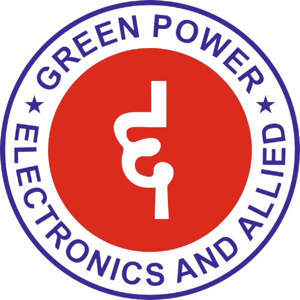

# Green Power Electronics & Allied - Official Website

A modern, responsive website for Green Power Electronics & Allied Industries, a leading manufacturer of electrical control panels and automation solutions based in Bhubaneswar, Odisha.



## 🌟 Features

- **Modern Design**: Sleek, professional design with neon lime accent colors and smooth animations
- **Responsive Layout**: Fully responsive design that works on all devices
- **Smooth Animations**: Framer Motion powered animations for engaging user experience
- **Contact Form**: Direct email integration using Nodemailer
- **Toast Notifications**: Real-time feedback for form submissions
- **Product Showcase**: Infinite scrolling product carousel
- **Interactive Sections**: Smooth scroll transitions between sections
- **Company Gallery**: Auto-scrolling image galleries showcasing company work

## 🛠️ Tech Stack

### Frontend
- **React 19** - UI library
- **Vite** - Build tool and dev server
- **Tailwind CSS 4** - Utility-first CSS framework
- **Framer Motion** - Animation library
- **Lucide React** - Icon library
- **React Hot Toast** - Toast notifications

### Backend
- **Node.js** - Runtime environment
- **Express** - Web framework
- **Nodemailer** - Email sending
- **CORS** - Cross-origin resource sharing
- **dotenv** - Environment variable management

## 📋 Prerequisites

- Node.js (v18 or higher)
- npm or yarn
- Gmail account with App Password enabled

## 🚀 Installation

1. **Clone the repository**
   ```bash
   git clone <repository-url>
   cd greenpower
   ```

2. **Install dependencies**
   ```bash
   npm install
   ```

3. **Configure environment variables**
   
   Create/update the `.env` file in the root directory:
   ```env
   EMAIL_USER=greenpower.nk@gmail.com
   EMAIL_PASS=your_gmail_app_password_here
   PORT=3001
   ```

4. **Get Gmail App Password**
   - Go to Google Account Security: https://myaccount.google.com/security
   - Enable 2-Step Verification
   - Go to "App passwords"
   - Generate a new app password for "Mail"
   - Copy the 16-character password to `.env`

## 🏃 Running the Application

### Development Mode

You need to run both the frontend and backend servers:

**Terminal 1 - Backend Server:**
```bash
npm run server
```

**Terminal 2 - Frontend Dev Server:**
```bash
npm run dev
```

The application will be available at:
- Frontend: http://localhost:5173
- Backend API: http://localhost:3001

### Production Build

```bash
npm run build
npm run preview
```

## 📁 Project Structure

```
greenpower/
├── src/
│   ├── assets/
│   │   └── images/          # Logo and images
│   ├── components/
│   │   ├── About.jsx        # About section
│   │   ├── Contact.jsx      # Contact form with email
│   │   ├── Footer.jsx       # Footer section
│   │   ├── Hero.jsx         # Hero/landing section
│   │   ├── Navbar.jsx       # Navigation bar
│   │   ├── Products.jsx     # Products showcase
│   │   └── Services.jsx     # Services section
│   ├── Pages/
│   │   └── Home.jsx         # Main page component
│   ├── App.jsx              # Root component
│   ├── main.jsx             # Entry point
│   └── index.css            # Global styles
├── server.js                # Express backend server
├── .env                     # Environment variables
├── package.json             # Dependencies
└── vite.config.js          # Vite configuration
```

## 🎨 Color Scheme

- **Primary Green**: #10B981 (for "GREEN")
- **Primary Red**: #EF4444 (for "POWER")
- **Primary Blue**: #3B82F6 (for "Electronics & Allied")
- **Accent Lime**: #CDFF00 (neon lime for highlights)
- **Background Dark**: #020617 (slate-950)
- **Background Medium**: #0f172a (slate-900)

## 📧 Email Configuration

The contact form sends emails directly to `greenpower.nk@gmail.com` using Nodemailer.

**Email Features:**
- Direct email sending (no redirect to Gmail/Outlook)
- Toast notifications for success/failure
- Form validation
- Loading states
- Automatic form reset on success

## 🔧 Available Scripts

- `npm run dev` - Start frontend development server
- `npm run server` - Start backend server
- `npm run build` - Build for production
- `npm run preview` - Preview production build
- `npm run lint` - Run ESLint

## 📱 Sections

1. **Hero Section** - Eye-catching landing with company tagline and stats
2. **About Section** - Company history and features with image gallery
3. **Products Section** - Infinite scrolling product showcase
4. **Contact Section** - Contact form with map and company details
5. **Footer** - Company information and social links

## 🌐 Products & Services

- MCC Panels (Motor Control Centers)
- APFC Panels (Automatic Power Factor Correction)
- PLC Panels (Programmable Logic Controller)
- AMF Panels (Automatic Mains Failure)
- Display Boards
- Maintenance Services

## 📍 Company Information

**Green Power Electronics & Allied Industries**
- Address: Plot no. 76-B, Sec-A, Zone-D, Mancheswar Industrial Estate, Bhubaneswar, Odisha 751010
- Phone: +91 89080 15160 / 9937835160
- Email: greenpower.nk@gmail.com
- Working Hours: Mon-Sat, 09:00 AM - 09:00 PM
- GST: 21BTPPK5437G1ZN
- Certification: ISO 9001:2015 Certified

## 🚀 Deployment

### Frontend Deployment (Vercel/Netlify)
1. Build the project: `npm run build`
2. Deploy the `dist` folder
3. Update the API URL in `Contact.jsx` to your backend URL

### Backend Deployment (Railway/Heroku/Render)
1. Deploy `server.js` to your hosting service
2. Set environment variables (EMAIL_USER, EMAIL_PASS, PORT)
3. Update CORS settings if needed

## 🔒 Security Notes

- Never commit `.env` file to version control
- Use environment variables for sensitive data
- Enable Gmail App Passwords (don't use regular password)
- Keep dependencies updated

## 🐛 Troubleshooting

**Email not sending:**
- Check if backend server is running
- Verify Gmail App Password in `.env`
- Check console for error messages
- Ensure 2FA is enabled on Gmail account

**CORS errors:**
- Backend is configured to accept all origins in development
- Update CORS settings for production

**Port conflicts:**
- Change PORT in `.env` if 3001 is already in use

## 📄 License

© 2026 Green Power Electronics And Allied Industries. All rights reserved.

## 👨‍💻 Development

Built with ❤️ for Green Power Electronics & Allied Industries


